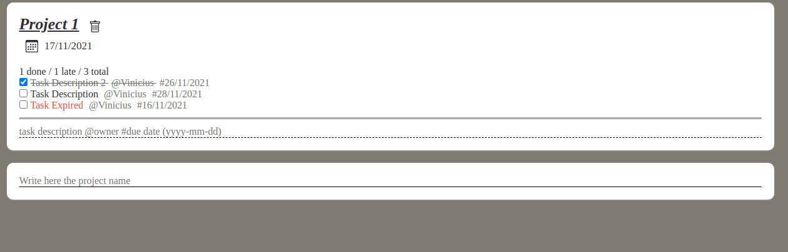

# Task Manager

### Explain:
* api - is the backend folder with nodejs
* app - is the frontend folder with nextjs (SSR)

```sh
git clone https://github.com/vinicinbgs/task-manager.git

docker-compose up -d --build

docker-compose exec api yarn sequelize db:migrate
```

after run this commands you can open in browser http://localhost:3000

<table>
  <thead>
    <th>Container</th>
    <th>Port</th>
  </thead>
  <tbody>
    <tr>
      <td>API</td>
      <td>9000</td>
    </tr>
    <tr>
      <td>APP</td>
      <td>3000</td>
    </tr>
    <tr>
      <td>MySQL</td>
      <td>3306</td>
    </tr>
  </tbody>
</table>

## Screenshots

